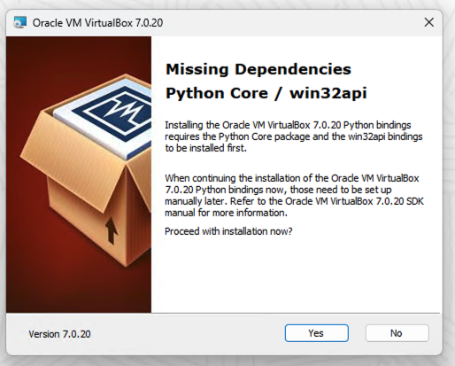
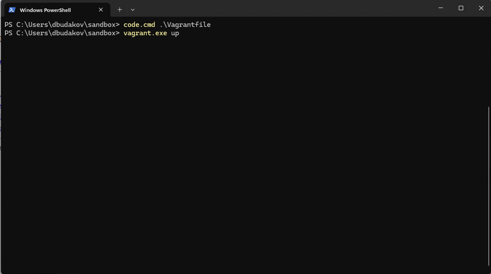

## Windows
### VirtualBox
- Перейти на [страницу загрузок virtualbox](https://www.virtualbox.org/wiki/Download_Old_Builds)
    - 
- Выбрать [_VirtualBox 7.0.20_ -> _Windows hosts_](https://www.virtualbox.org/wiki/Download_Old_Builds_7_0)
    - 
- Установка пакета проходит штатно
    - 
    - 
    - 
    - 
    - 
    - 
    - 
    - 
### Vagrant
- Перейти на [страницу загрузок vagrant(зеркало)](https://releases.comcloud.xyz/vagrant/)
    - 
- Выбрать [_vagrant_2.4.1_ -> _vagrant_2.4.1_windows_amd64.msi_](https://releases.comcloud.xyz/vagrant/2.4.1/)
    - 
- Установка пакета проходит штатно
    - 
    - 
    - 
    - 
    - 
    - 
### Vagrantfile
- Создать руками или инициализировать _Vagrantfile_  
    - ```powershell
      vagrant.exe init
      ```
    - 
- Будет создан дефолтный _Vagrantfile_
    - 

- Открыть 
    - ```powershell
      code.cmd Vagrantile # если установлен vscode
      notepad.exe Vagrantfile # если использовать блокнот
      ```
    - 
    - 
- Добавить настройки для доступа к образам  
_Vagrantfile_ - описывает стенд, который создается в виртуальном окружении    
На данный момент доступ к базовым хранилищам образов виртуальных машин ограничен, поэтому в _Vagrantfile_ требуется указать зеркало образов виртуальных машин  
    
    ```ruby
    # -*- mode: ruby -*-
    # vi: set ft=ruby :

    ENV['VAGRANT_SERVER_URL']="https://vagrant.elab.pro"

    Vagrant.configure("2") do |config|
      config.vm.box_check_update = false
      config.vm.box = "bento/ubuntu-24.04"
    end
    ```
    
    - 
- После чего запустить создание машин
    - ```powershell
      vagrant.exe up
      ```
    - 
    - 

- Доступ на машину осуществляется по _ssh_ командой ниже
    - ```powershell
      vagrant.exe ssh
      ```
    - 

- После работы с машиной, удалить ее можно следующей командой
    - ```powershell
      vagrant.exe destroy -f
      ```
    - 


### Ссылки
- Скачать [пакет virtualbox для windows](https://download.virtualbox.org/virtualbox/7.0.20/VirtualBox-7.0.20-163906-Win.exe)
- Скачать [пакет vagrant для windows](https://releases.comcloud.xyz/vagrant/2.4.1/vagrant_2.4.1_windows_amd64.msi)
